> A cross-platform native application that transforms emotional journaling into an intelligent, science-backed experience, combining Plutchik's psychological theory with dual-provider AI analysis, end-to-end encryption, and gamification — available on Android and iOS.

**Download DayMood:** [App Store (iOS)](https://apps.apple.com/es/app/daymood/id6758305629) · [Google Play (Android)](https://play.google.com/store/apps/details?id=com.jaimelxpez.daymoodApp)

**Role:** Sole developer — designed, architected, and shipped both platforms from zero to production. Responsible for all product decisions, UX design, architecture, implementation, analytics instrumentation, and store releases.

### At a Glance

- **19 Gradle modules + 30 SPM targets** — Clean Architecture on both platforms with strict layer separation → [Architecture](#architecture)
- **Cross-platform E2E encryption** — AES-256-GCM with deterministic key derivation (HKDF-SHA256) so entries created on Android decrypt on iOS → [Encryption Architecture](#end-to-end-encryption-architecture)
- **Dual AI provider** — Gemini 2.5 Pro (primary) + OpenAI GPT-4o (fallback), switchable via Remote Config with zero downtime → [Analysis Engine](#intelligent-analysis-engine)
- **2,296 users in 28 days** — Organic discovery across 5+ countries; funnel analysis drove a complete onboarding redesign → [Analytics & Iteration](#product-analytics--data-driven-iteration)
- **98.64% crash-free** — Silent non-fatal reporting across 9 critical modules (crypto, AI, billing, auth) → [Stability](#stability-crashlytics-90-day-window)
- **4-layer privacy firewall** — Defense-in-depth that makes it physically impossible for diary content to leak through logs, analytics, or monitoring → [Privacy Firewall](#fail-safe-privacy-firewall-defense-in-depth)

---

## The Challenge

### The Real Problem

Emotional journaling has demonstrated significant mental health benefits, but most existing applications present critical limitations:

1. **Subjectivity without structure**: Users describe emotions freely without a scientifically-grounded framework that enables longitudinal analysis.
2. **Lack of actionable insights**: Apps record data but don't offer patterns or causal connections.
3. **High entry barrier**: Writing about emotions requires emotional vocabulary that many users don't possess.
4. **Disconnect from triggers**: The relationship between life events and emotional responses isn't identified.
5. **Privacy concerns**: Users hesitate to write honestly when diary content could be read by developers or leaked through logs.

### The Vision

Create an application that acts as a **pocket wellness companion**: the user writes freely about their day, and AI automatically identifies underlying emotions using Plutchik's psychological model, revealing patterns that the user themselves doesn't consciously perceive — all protected by end-to-end encryption that makes it physically impossible for anyone (including the developer) to read user entries.

### High-Level Architecture

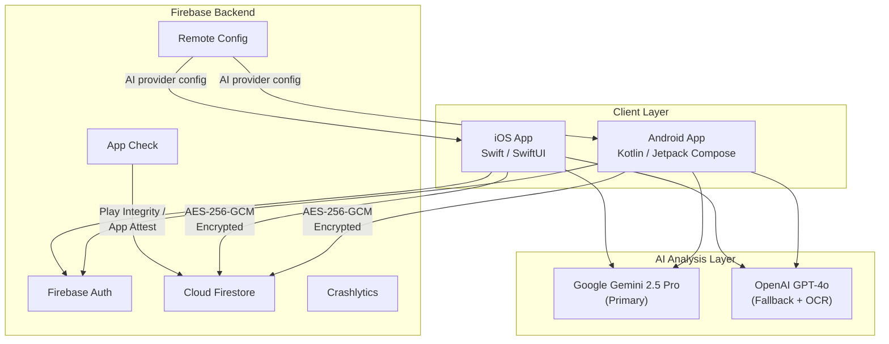

---

# Part I — Android (Primary Platform)

## Architecture

### Multi-Module Clean Architecture

DayMood Android implements Clean Architecture rigorously with **19 independent Gradle modules**, ensuring separation of responsibilities, testability, and scalability.

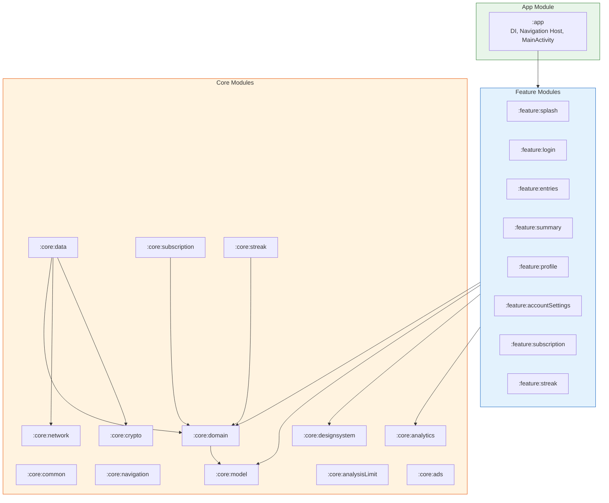

### Layer Flow

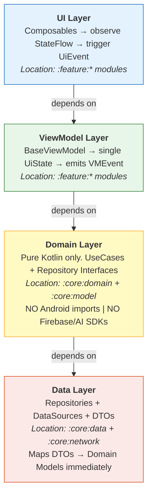

### Key Applied Principles

| Principle | DayMood Implementation |
|-----------|------------------------|
| **Single Source of Truth** | Each feature has a single immutable UiState |
| **Unidirectional Data Flow** | UI → Event → ViewModel → UseCase → Repository → UI |
| **Dependency Inversion** | Domain layer doesn't know Android, Firebase, or AI SDKs |
| **DTO Isolation** | API models never reach the UI |

---

## Tech Stack

### Core Technologies

| Category | Technology | Version |
|----------|------------|---------|
| **Language** | Kotlin | 2.3.0 |
| **UI Framework** | Jetpack Compose | BOM 2026.01.00 |
| **Design System** | Material 3 | 1.4 |
| **DI** | Hilt | 2.57.1 |
| **Async** | Kotlin Coroutines + Flow | — |
| **Navigation** | Navigation 3 | 1.0.1 (stable) |
| **Networking** | Retrofit + OkHttp | 2.11.0 / 4.12.0 |
| **Image Loading** | Coil 3 | 3.3.0 |
| **Rich Text** | compose-rich-editor | 1.0.0-rc13 |
| **Markdown** | multiplatform-markdown-renderer-m3 | 0.39.2 |

### Backend & AI

| Category | Technology | Usage |
|----------|------------|-------|
| **Authentication** | Firebase Auth | Google Sign-In, Email/Password |
| **Database** | Cloud Firestore | Entry persistence (E2E encrypted) |
| **AI Analysis (Primary)** | Google Gemini 2.5 Pro (Firebase AI SDK) | Emotion analysis based on Plutchik model |
| **AI Analysis (Fallback)** | OpenAI API (GPT-4o) | Fallback provider + OCR cleanup |
| **AI Switching** | Firebase Remote Config | Dynamic provider switching |
| **OCR** | ML Kit Text Recognition | Physical diary digitization |
| **Camera** | CameraX | Capture for OCR |
| **Crash Reporting** | Firebase Crashlytics | Error monitoring + silent non-fatal reporting |
| **E2E Encryption** | Jetpack Security + HKDF-SHA256 | AES-256-GCM sensitive data protection |
| **App Check** | Firebase App Check + Play Integrity | Backend protection against abuse |
| **Subscriptions** | Google Play Billing 7.x | Premium paywall and subscription management |
| **Ads** | Google Mobile Ads | Interstitial, app open, and rewarded ads |
| **Notifications** | WorkManager | Daily reminders, weekly summaries |
| **In-App Review** | Google Play In-App Review API | Review prompt after first entry |

### Build System

| Tool | Version |
|------|---------|
| Android Gradle Plugin | 8.13.2 |
| Gradle | 8.13 |
| Min SDK | 29 (Android 10) |
| Target/Compile SDK | 36 |

---

## Design System: "Organic Wellness"

### Visual Philosophy

DayMood adopts a **minimalist and warm aesthetic** inspired by wellness and nature, deliberately moving away from the cold colors typical of productivity apps. The design system is shared across both platforms, adapted to each platform's conventions.

### Color Palette

| Token | Light Mode | Dark Mode | Usage |
|-------|------------|-----------|-------|
| `background` | `#F9F7F4` (Cream) | `#121212` | Screen backgrounds |
| `white` | `#FFFDF9` (Warm White) | `#1E1E1E` | Card surfaces |
| `sand` | `#D2B28F` | `#E5C9A8` | Buttons, accents |
| `primary` | `#ADD6EA` (Soft Blue) | `#ADD6EA` | Primary elements |
| `tertiary` | `#8B4513` (Sienna) | `#A0522D` | Highlights |
| `coral` | `#FF7F7F` | `#FF9999` | Errors, emergency |

### Typography: Dual-Font System

**Manrope** was chosen as the primary sans-serif font for its WCAG 2.1 AA compliance, superior legibility at small sizes, and significantly reduced bundle weight (75% lighter than alternatives like Montserrat: 162KB vs 672KB).

| Font | Usage | Characteristics |
|------|-------|-----------------|
| **Manrope** (Sans-Serif) | UI, body text, labels | Modern geometric with rounded terminals. Superior legibility at small sizes. WCAG 2.1 AA compliant. |
| **Lora** (Serif) | Display, greetings, editorial content | Elegant editorial character for emotional moments and highlighted titles. |

**Weight Hierarchy:**

```
Large titles (20-34sp) → Normal (400)   ← Elegance without excessive weight
      ↓
Body text (16-17sp)    → Medium (500)   ← Comfortable extended reading
      ↓
Small text (11-15sp)   → SemiBold (600) ← Maximum clarity and contrast
```

### Shapes

- **Cards**: `RoundedCornerShape(24.dp)` — Very rounded corners for organic feel
- **Buttons**: `RoundedCornerShape(16.dp)` — Soft and accessible
- **Chips**: `RoundedCornerShape(12.dp)` — Compact but friendly

---

## Key Product Decisions

Every technical decision in DayMood is driven by a product insight. These are the most impactful ones:

| Decision | User Problem | Solution | Why It Matters |
|----------|-------------|----------|----------------|
| **EmotionWheel (pizza-slice)** | Selecting emotions from a dropdown feels detached and clinical | A visual pie-sector wheel where users tap colored slices with emojis | More engaging, mirrors how emotions are represented in psychology research (Plutchik's circular model), and reduces cognitive load — users recognize emotions visually instead of reading lists |
| **Breathing animation during AI analysis** | AI analysis takes ~15 seconds; a spinner creates anxiety | A gentle pulsing animation that mimics a breathing exercise | Transforms wait time into a calming micro-interaction — designed to reduce perceived wait anxiety |
| **User always has the last word** | AI is not infallible — wrong emotion detection erodes trust | After AI analysis, users can edit intensities, add/remove emotions, and change triggers before saving. AI can be fully disabled in settings | Builds trust: the AI is a suggestion engine, never an authority. Users stay in control of their own emotional narrative |
| **CryptoGate screen** | Race condition: ViewModels could access uninitialized encryption keys | A blocking intermediate screen between login and home that waits until E2E encryption is fully ready | Prevents corrupted data display; clean UX > fast UX when privacy is at stake |
| **Crisis detection as safety net** | AI might miss suicidal ideation or crisis language | Local keyword detector with extensive crisis patterns (EN/ES) that runs independently of AI | Not a medical tool — a responsible safety layer. Links to real crisis hotlines for 17+ countries |
| **Rewarded ads over hard paywall** | Aggressive monetization kills retention in wellness apps | Free users hit an analysis limit, then earn 1 bonus analysis by watching a rewarded ad | Respects the user: they choose to watch an ad, they're not interrupted. Conversion to premium happens naturally |
| **Editable onboarding with "experience" flow** | Users drop off if they don't understand the value before signing up | A guided first experience where users write a mini-entry and see AI analysis *before* creating an account | Users experience the "wow moment" before any commitment — the product sells itself |

---

## Core Feature: Plutchik Emotion System

### Theoretical Foundation

DayMood implements **Plutchik's Wheel of Emotions**, a well-established psychological model that categorizes human emotions into 8 primary roots with intensity variations — totaling 32 distinct emotions.


*Source: [Six Seconds — The Emotional Intelligence Network](https://www.6seconds.org)*

### 8 Emotion Roots

| Root | Pastel Color | Dark Color | Emotions (Basic, Intense, Mild) |
|------|--------------|------------|--------------------------------|
| **Joy** | `#F9E79F` | `#C9A227` | Joy, Ecstasy, Serenity |
| **Trust** | `#82E0AA` | `#27AE60` | Trust, Admiration, Acceptance |
| **Fear** | `#76B84E` | `#4A7C23` | Fear, Terror, Apprehension |
| **Surprise** | `#BB8FCE` | `#8E44AD` | Surprise, Amazement, Distraction |
| **Sadness** | `#85C1E9` | `#2E86AB` | Sadness, Grief, Pensiveness |
| **Disgust** | `#D7BDE2` | `#9B59B6` | Disgust, Loathing, Boredom |
| **Anger** | `#F1948A` | `#C0392B` | Anger, Rage, Annoyance |
| **Anticipation** | `#F8B88B` | `#D35400` | Anticipation, Vigilance, Interest |

### Emoji Selection: Research-Based Approach

The emoji selection is based on **Paul Ekman's foundational research** on universal emotions and peer-reviewed studies on emoji emotion recognition:

- [**PMC10175112**](https://pmc.ncbi.nlm.nih.gov/articles/PMC10175112/): "Emotion Recognition of Faces and Emoji" — recognition accuracy analysis
- [**PMC10045925**](https://pmc.ncbi.nlm.nih.gov/articles/PMC10045925/): "Emojis Are Comprehended Better than Facial Expressions"
- [**PMC9231464**](https://pmc.ncbi.nlm.nih.gov/articles/PMC9231464/): "The Multidimensional Lexicon of Emojis" — includes Plutchik's 8 emotions mapping

### 16 Life Triggers

The system maps emotions to **life domains** that act as triggers:

| Domain | Example Insight |
|--------|-----------------|
| Family relationships | "Your family continues to be a source of joy" |
| Work/Career | "Work has been your main source of anxiety" |
| Mental health | "Your mental wellbeing shows positive patterns" |
| Romantic partner | "Your relationship brings both joy and anxiety" |
| Finances/Economy | "Finances are influencing your worry" |
| Achievements/Goals | "Achieving goals produces consistent satisfaction" |

### EmotionWheel: Pizza-Slice Visual Design

The `EmotionWheel` component uses a **pizza-slice (pie sector) style** for optimal visual hierarchy and touch interaction:

- 8 filled pie sectors (one per root emotion) with 2-degree gap between slices
- Inner radius cutout creates donut shape
- Each slice displays its emoji centered on the arc
- Selection animation: slight scale (1.05x) + colored border + glow effect
- Companion `EmotionWheelShowcase` for read-only analysis preview


---

## Intelligent Analysis Engine

### Provider Selection: Data-Driven Decision

Both OpenAI GPT-4o and Google Gemini 2.5 Pro were evaluated with **10 real diary entries** (5 Spanish, 5 English) covering diverse emotional scenarios. The evaluation prioritized analysis quality over speed, since emotional journaling is a reflective activity — not a real-time one.

| Criterion | Gemini 2.5 Pro | OpenAI GPT-4o | Decision Factor |
|-----------|----------------|---------------|-----------------|
| **Analysis quality** | Rich, nuanced insights with full Plutchik mapping | Concise, surface-level responses | Gemini: consistently deeper emotional analysis |
| **JSON consistency** | 100% valid structured output | Frequently wrapped in markdown code fences | Gemini: zero parsing errors in production |
| **Cost per analysis** | $0.00538 | $0.00675 | Gemini: 20% savings at scale |
| **Latency** | ~16s | ~4s | OpenAI faster, but acceptable for reflective use |
| **Plutchik compliance** | Strictly within 32-emotion vocabulary | Occasionally invents emotions | Gemini: better model alignment |

**Result:** Gemini 2.5 Pro as primary provider, OpenAI GPT-4o as automatic fallback. Switching is controlled via Firebase Remote Config — zero-downtime provider changes without app updates.

**UX mitigation for latency:** A breathing animation during analysis transforms wait time into a calming micro-interaction, reducing perceived wait anxiety.

### Dynamic Switching Architecture

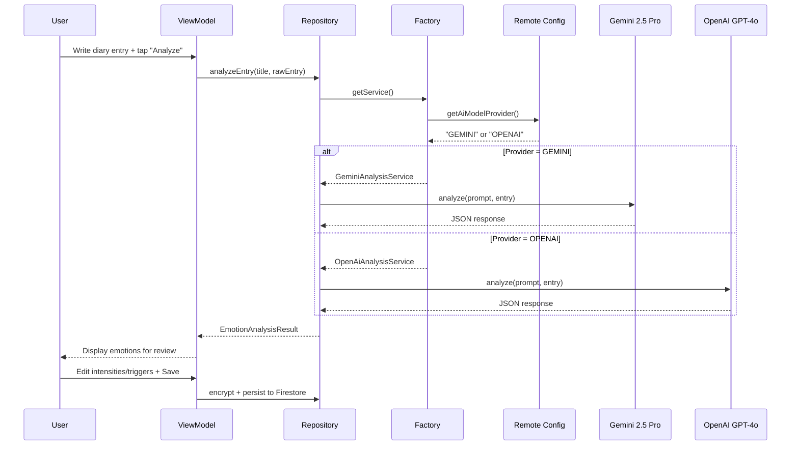

### Structured Prompt Design

Both providers receive carefully designed prompts that constrain output to Plutchik's framework:

1. Identify emotions using exclusively the 32-emotion vocabulary
2. Assign intensity on a 1–10 scale based on language cues
3. Map triggers to the 16 predefined life domains
4. Provide brief emotional context for each detected emotion
5. Respond in the user's language (Spanish or English)

The user always reviews and can edit the AI's suggestions before saving — the AI proposes, the user decides.

---

## Navigation Architecture

### Navigation 3: Scene-Based Composition

DayMood Android uses **Navigation 3**, Google's next-generation navigation library featuring a declarative scene-based approach with direct backstack manipulation.

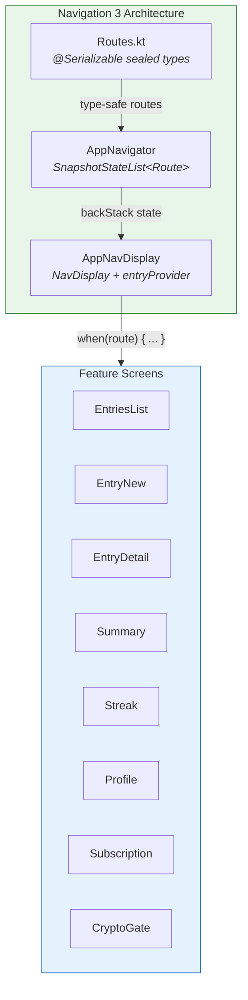

**Key Principles:**
- `SnapshotStateList<Route>` as single source of truth — navigation is list manipulation
- `NavDisplay` renders current route via `when(route) { ... }` lambda
- Type-safe routes using Kotlin Serialization (`@Serializable` data classes/objects)
- ViewModels emit `VMEvent`s, UI invokes navigation callbacks
- No `NavController` abstraction — direct, testable backstack manipulation

**Custom Transitions:**
- Forward: slides from right with parallax effect on old screen + fade
- Back: slides from left while current exits right
- Predictive back gesture matching for Android 14+

**CryptoGate Screen:**
An intermediate screen between authentication and home that blocks navigation until E2E encryption is fully initialized (with a configurable timeout). This eliminates race conditions where ViewModels accessed uninitialized DEKs.

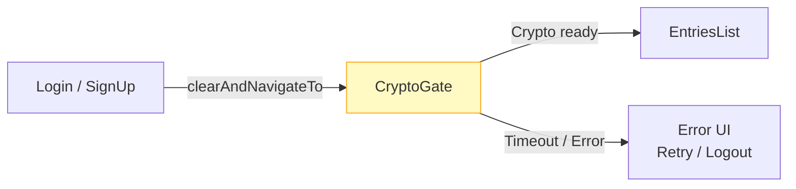

---

## Clean Code Patterns (Android)

Good architecture needs good code habits to sustain it. Here are the patterns enforced consistently across every feature module in DayMood.

### Unidirectional Data Flow: UiEvent → ViewModel → UiState

Every feature follows a strict **UiEvent / UiState / VMEvent** contract:

- **`UiEvent`** — user actions flow *into* the ViewModel via a single `onEvent()` entry point
- **`UiState`** — a single immutable `data class` exposed as `StateFlow` drives the entire screen
- **`VMEvent`** — one-shot navigation or side-effects emitted via `SharedFlow`

```kotlin
// Feature-scoped import aliases keep ViewModels clean
import …feature.entries.list.model.EntriesListUiEvent as UiEvent
import …feature.entries.list.model.EntriesListUiState as UiState
import …feature.entries.list.model.EntriesListVMEvent as VMEvent

@HiltViewModel
class EntriesListViewModel @Inject constructor(
    private val getEntriesUseCase: GetDiaryEntriesUseCase,
    private val analyticsManager: AnalyticsManager,
    …
) : BaseViewModel() {

    private val _uiState = MutableStateFlow(UiState())
    val uiState = _uiState.asStateFlow()

    private val _vmEvent = MutableSharedFlow<VMEvent>()
    val vmEvent = _vmEvent.asSharedFlow()

    fun onEvent(event: UiEvent) {
        when (event) {
            is UiEvent.OnEntryClick -> { … }
            is UiEvent.OnNewEntryClick -> { … }
            is UiEvent.OnSearchClick -> { … }
            // exhaustive — compiler enforces every case
        }
    }
}
```

> **Why it matters:** Every feature in the app follows this exact same shape. A new developer can open *any* ViewModel and immediately know where state lives, where events enter, and where side-effects are emitted — zero guesswork.

### Hierarchical Error Handling with Sealed Failure Classes

Instead of catching generic exceptions everywhere, errors are modeled as a **sealed hierarchy** that maps to specific recovery paths:

```kotlin
sealed class Failure : Throwable() {

    sealed class DekFailure : Failure() {
        data object NotFound : DekFailure()
        data object GenerationFailed : DekFailure()
        data object InvalidKey : DekFailure()
    }

    sealed class GoogleSignInFailure : Failure() {
        data object Cancelled : GoogleSignInFailure()
        data object NoCredentialsAvailable : GoogleSignInFailure()
        data object FirebaseAuthFailed : GoogleSignInFailure()
        …
    }

    sealed class CryptoOperationFailure : Failure() {
        data object EncryptionFailed : CryptoOperationFailure()
        data object DecryptionFailed : CryptoOperationFailure()
        data object AuthenticationFailed : CryptoOperationFailure()
        …
    }
}

// One-line conversion anywhere in the codebase
fun Throwable.toFailure(): Failure =
    this as? Failure ?: Failure.GenericFailure()
```

> **6 domain-specific failure groups** (Crypto, Auth, Ads, Backup, Passwords, Network), each with exhaustive `when` branches — no `else` fallthrough hiding bugs.

### Use Cases with `operator fun invoke`

Domain use cases are single-purpose classes with an `invoke` operator, making call sites read like plain function calls:

```kotlin
class SaveDiaryEntryUseCase @Inject constructor(
    private val diaryRepository: DiaryRepository
) {
    operator fun invoke(
        title: String,
        rawEntry: String,
        emotionFacts: List<EmotionFact>
    ): Flow<Unit> =
        diaryRepository.saveEntry(title, rawEntry, emotionFacts)
}

// At the call site — reads naturally:
saveDiaryEntryUseCase(title, rawEntry, emotionFacts)
```

### BaseViewModel: Shared Behavior Without Inheritance Tax

A lightweight base class provides cross-cutting concerns via **Flow extensions** instead of abstract methods:

```kotlin
open class BaseViewModel @Inject constructor() : ViewModel() {

    @Inject lateinit var loadingPresenter: LoadingPresenter

    fun <T> Flow<T>.handleLoading(): Flow<T> =
        this
            .onStart { loadingPresenter.showLoading() }
            .onCompletion { loadingPresenter.hideLoading() }
}

// Usage in any ViewModel:
analyzeEmotionsUseCase(text)
    .handleLoading()      // ← loading spinner managed automatically
    .catch { … }
    .collect { result -> … }
```

### Lifecycle-Safe Flow Collection

A reusable `FlowCollector` composable replaces boilerplate `LaunchedEffect` + `repeatOnLifecycle` in every screen:

```kotlin
@Composable
fun <T> FlowCollector(
    flow: Flow<T>,
    lifecycleState: Lifecycle.State = Lifecycle.State.STARTED,
    collect: (T) -> Unit
) {
    val lifecycle = LocalLifecycleOwner.current
    LaunchedEffect(Unit) {
        lifecycle.repeatOnLifecycle(lifecycleState) {
            flow.collect(collect)
        }
    }
}

// In any screen composable:
FlowCollector(viewModel.vmEvent) { event ->
    when (event) {
        is VMEvent.NavigateToDetail -> navController.navigate(…)
        is VMEvent.ShowError -> snackbar.show(…)
    }
}
```

### Testable Coroutine Dispatchers

Dispatchers are **never hardcoded** — an injectable `DispatcherProvider` interface allows swapping `Dispatchers.IO` for `TestDispatcher` in unit tests:

```kotlin
interface DispatcherProvider {
    val main: CoroutineDispatcher
    val io: CoroutineDispatcher
    val default: CoroutineDispatcher
}

// Production
class StandardDispatchers : DispatcherProvider { … }

// Tests — everything runs synchronously
class TestDispatcherProvider(
    private val testDispatcher: TestDispatcher = StandardTestDispatcher()
) : DispatcherProvider {
    override val main = testDispatcher
    override val io = testDispatcher
    override val default = testDispatcher
}
```

### Clean Layer Boundaries: Mappers

Data Transfer Objects (DTOs) never leak into the domain layer. A `BaseDTO<T>` interface enforces that every DTO knows how to convert itself, and Flow extensions eliminate boilerplate at the repository level:

```kotlin
// BaseDTO contract — every DTO must map to its domain model
interface BaseDTO<T> {
    fun toDomainModel(): T
}

// Flow extensions — zero-boilerplate mapping in repositories
fun <T> Flow<List<BaseDTO<T>>>.mapListToDomain(): Flow<List<T>> =
    map { items -> items.map { it.toDomainModel() } }

fun <T> Flow<BaseDTO<T>>.mapToDomain(): Flow<T> =
    map { it.toDomainModel() }
```

Each DTO implements the contract with self-contained conversion logic — no external mapper classes needed:

```kotlin
data class DiaryEntryDTO(
    val title: String = "",
    val rawEntry: String = "",
    val data: EntryDataDTO = EntryDataDTO(),
    @ServerTimestamp
    val createdAt: Timestamp? = null
): BaseDTO<DiaryEntry> {

    override fun toDomainModel(): DiaryEntry = DiaryEntry(
        title = title,
        rawEntry = rawEntry,
        data = data.toDomainModel(),
        date = createdAt?.toDate()
    )
}
```

### Convention Plugins: DRY Build Configuration

Instead of duplicating Gradle configuration across 19 modules, a `build-logic` module defines **custom convention plugins** that enforce consistency:

```kotlin
// build-logic/convention/AndroidFeatureConventionPlugin.kt
class AndroidFeatureConventionPlugin : Plugin<Project> {
    override fun apply(target: Project) {
        with(target) {
            with(pluginManager) {
                apply("daymood.android.library")
                apply("daymood.android.library.compose")
                apply("daymood.hilt")
            }
            dependencies {
                add("implementation", project(":core:designsystem"))
                add("implementation", project(":core:ui"))
                add("implementation", project(":core:model"))
                add("implementation", project(":core:domain"))
                add("implementation", project(":core:common"))
                add("implementation", project(":core:analytics"))
                add("implementation", project(":core:navigation"))
                add("testImplementation", project(":core:testing"))
            }
        }
    }
}

// Any feature module's build.gradle.kts — one line:
plugins {
    alias(libs.plugins.daymood.android.feature)
}
```

> **Why it matters:** Adding a new feature module takes 30 seconds. The plugin guarantees it gets Compose, Hilt, design system, analytics, and test dependencies — no copy-paste, no drift between modules.

### Type-Safe Navigation with @Serializable Routes

Navigation routes are `@Serializable` data classes with compile-time checked parameters — no string-based route matching:

```kotlin
@Serializable
data class AnalysisPreview(
    val userName: String,
    val miniEntryText: String,
    val isDemo: Boolean = false
) : Route

@Serializable
data class EntryNewEmotionList(
    val title: String,
    val rawEntry: String,
    val emotionFactList: List<EmotionFact>,
    val entryId: String? = null
) : Route

// Navigate with compiler-checked parameters:
navigator.navigateTo(
    AnalysisPreview(userName = "Jaime", miniEntryText = text)
)
```

### Decoupled Feature Navigation

Each feature module exposes a **NavGraphBuilder extension** with lambda callbacks instead of receiving a `NavController` — features never depend on each other:

```kotlin
// feature/entries — knows nothing about other features
fun NavGraphBuilder.entryNewScreen(
    onNavigateToBreathingAnalysis: (title: String, rawEntry: String) -> Unit,
    onNavigateToEmotionsList: (List<EmotionFact>) -> Unit,
    onNavigateBack: () -> Unit
) {
    composable<EntryNew> { backStackEntry ->
        EntryNewRoute(
            diaryEntryToEdit = backStackEntry.toRoute<EntryNew>().diaryEntry,
            onNavigateToBreathingAnalysis = onNavigateToBreathingAnalysis,
            onNavigateBack = onNavigateBack
        )
    }
}

// Wired together only in :app module's NavHost
```

> **Why it matters:** Feature modules can be compiled, tested, and previewed in complete isolation. The `:app` module is the only place that knows how features connect — making refactoring and reordering flows trivial.

### Hilt Modules: @Binds for Declarative DI

Repository bindings use `abstract @Binds` instead of `@Provides` — a declarative approach where Hilt resolves the interface-to-implementation mapping directly, without generating intermediate factory classes:

```kotlin
@Module
@InstallIn(SingletonComponent::class)
abstract class RepositoryModule {

    @Binds @Singleton
    abstract fun bindDiaryRepository(
        impl: DiaryRepositoryImpl
    ): DiaryRepository

    @Binds @Singleton
    abstract fun bindEmotionAnalysisRepository(
        impl: EmotionAnalysisRepositoryImpl
    ): EmotionAnalysisRepository
}
```

### Pattern Summary

| Pattern | Applied across | Purpose |
|---------|---------------|---------|
| `UiEvent` / `UiState` / `VMEvent` | 15+ feature screens | Predictable unidirectional flow |
| Import aliases (`as UiEvent`) | Every ViewModel | Clean, scannable code |
| Sealed `Failure` hierarchy | 6 domain groups | Exhaustive error handling |
| `operator fun invoke` use cases | All domain operations | Readable call sites |
| `handleLoading()` Flow extension | Every async operation | DRY loading state |
| `FlowCollector` composable | Every screen | Lifecycle-safe one-shot events |
| `DispatcherProvider` injection | All coroutine contexts | Deterministic testing |
| DTO ↔ Domain mappers | Every repository | Clean layer separation |
| Convention plugins (`build-logic`) | All 19 modules | DRY, consistent build config |
| `@Serializable` routes | 20+ routes | Compile-time safe navigation |
| Lambda-callback navigation | All feature modules | Zero inter-feature coupling |
| `@Binds` abstract modules | All repository bindings | Declarative DI |

> These aren't aspirational guidelines — they're enforced patterns applied consistently across 19 Gradle modules and 15+ feature screens. The result is a codebase where any screen can be understood in under a minute.

---

## Security Implementation

### Security Overview

| Area | Implementation |
|------|----------------|
| **API Keys** | `BuildConfig` via Gradle secrets plugin |
| **Session Storage** | `EncryptedSharedPreferences` (AES-256-SIV + AES-256-GCM) |
| **Input Validation** | `InputValidator` sanitizes before API calls |
| **E2E Encryption** | AES-256-GCM for diary entries (DEK/KEK dual-key system) |
| **Key Management** | DEK in Keystore, KEK derived from Firebase ID Token via HKDF |
| **App Check** | Firebase App Check with Play Integrity (release) / Debug provider (debug) |
| **Privacy Firewall** | 4-layer defense-in-depth: content redaction, SDK guards, analytics filtering, secure logging |
| **Crisis Detection** | Extensive keyword detector (EN/ES) as AI safety net |

### End-to-End Encryption Architecture

DayMood implements **end-to-end encryption** that ensures not even the developer can read user diary content. The same encryption protocol is used on both Android and iOS, enabling cross-device data access.

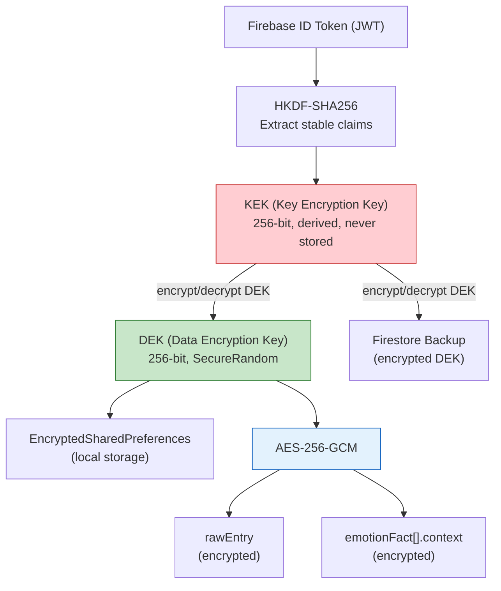

**Dual-Key System:**

| Key | Purpose | Storage | Derivation |
|-----|---------|---------|------------|
| **KEK** (Key Encryption Key) | Encrypts/decrypts the DEK for cloud backup | Never stored — derived on demand | HKDF-SHA256 from stable Firebase ID Token claims |
| **DEK** (Data Encryption Key) | Encrypts/decrypts diary entry content | `EncryptedSharedPreferences` (hardware-backed Keystore) | `SecureRandom` (generated once per user) |

**Encrypted Fields:**

| Field | Reason |
|-------|--------|
| `rawEntry` | Diary content (sensitive text) |
| `emotionFactList[].context` | Emotional context of each emotion |

**Fields in Cleartext (for analytics):** Metadata needed for charts and temporal ordering (emotion enums, intensity scores, timestamps) is stored unencrypted. Sensitive content (diary text, emotional context) is always encrypted.

**Multi-device Recovery:** The encrypted DEK is backed up to Firestore, allowing recovery on new devices with the same account.

### Fail-Safe Privacy Firewall (Defense-in-Depth)

DayMood implements a **4-layer defense-in-depth privacy firewall** that makes it physically impossible for diary entries to leak through logging or monitoring — regardless of Firebase Console configuration, debug settings, or developer errors.

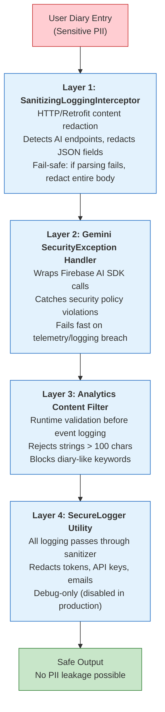

**Security Guarantees:**
- Diary entries in Logcat → **Impossible** (Layer 1 redacts)
- AI responses in HTTP logs → **Impossible** (Layer 1 redacts)
- PII in Firebase Analytics → **Blocked** (Layer 3 filters)
- Tokens/API keys in logs → **Sanitized** (Layer 4)
- Debug logging exposing content → **Redacted** (Layers 1 + 4)

### Privacy-Safe AI Telemetry

AI performance metrics (latency, token counts, error rates) are tracked without logging sensitive content, using type-safe event classes with primitive-only fields:

```kotlin
AiPerformanceEvent(
    provider = AiModelProvider.GEMINI,
    latencyMs = 16500L,
    inputTokens = 150,
    outputTokens = 250,
    totalTokens = 400,
    isSuccess = true,
    errorCode = null
)
```

---

## Subscription & Monetization

### Premium Subscription

DayMood uses **Google Play Billing 7.x** with a dedicated `:core:subscription` module:

| Plan | Price | Savings | Trial |
|------|-------|---------|-------|
| **Monthly** | €3.00/month | — | 7-day free trial |
| **Annual** | €19.99/year | 44% vs monthly | 7-day free trial |

**Trial Eligibility Detection:**
Google Play's SDK handles eligibility server-side: when a user has already redeemed a free trial, Google excludes the trial offer from `subscriptionOfferDetails`. The `BillingMapper` detects the presence of a zero-cost pricing phase to determine eligibility, ensuring the UI never shows trial messaging to ineligible users.

### Premium Features

| Feature | Free | Premium |
|---------|------|---------|
| Daily AI analyses | 5/day | Unlimited |
| Entry search | — | Full-text search |
| Summary periods | Week only | Today, week, month, year, custom |
| Ads | Interstitial + App Open | None |
| Weekly summary notification | Yes | Yes |

### Ad Strategy

| Ad Type | Trigger | Cooldown | Notes |
|---------|---------|----------|-------|
| **Interstitial** | After saving entry | 90 seconds | Grace period: 24h OR 3 entries |
| **App Open** | Foreground resume | 4 hours | `ProcessLifecycleOwner` detection |
| **Rewarded** | At analysis limit | 1/day max | Non-dismissible modal, earns 1 bonus analysis |

### In-App Review

Triggered after the user creates their **first diary entry** (capitalizing on the "aha moment" of first AI analysis). Maximum once per 30 days, skipped during ad display.

---

## Gamification & Retention

### Streak & Emotional Journey (v2.2.0)

A full gamification system designed to improve D7 retention through positive reinforcement:

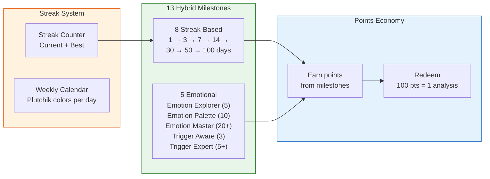

**Key Features:**
- Streak counter with fire emoji, best streak tracking
- 13 hybrid milestones: 8 streak-based (1 to 100 days) + 5 emotional diversity
- Points system: earn from milestones, redeem 100 points for 1 extra analysis
- Multi-quantity redemption with atomic Firestore transactions
- Weekly emotion calendar showing Plutchik root colors per day
- Personal insights (top trigger, dominant emotion, motivational)
- Notification warning cards with loss-aversion copy tied to streak length
- Sequential milestone progression (one active at a time)

### Daily Reminder Notifications

WorkManager-based with dynamic scheduling:
- 8 message variants + 3 title variants rotated by day
- Streak-aware messaging for users with 3+ day streaks
- Skips notification if user already wrote today
- Configurable time via time picker in Profile and Streak screens

---

## Product Analytics & Data-Driven Iteration

### Analytics-First Approach

Every screen, button, and flow in DayMood is instrumented with Google Analytics events. This isn't just for dashboards — it drives real product decisions.

### Funnel Analysis (28-day period, Android)

| Funnel Step | Users | Conversion | Insight |
|-------------|-------|------------|---------|
| First open | 2,296 | 100% | Organic discovery across LATAM + Europe |
| Onboarding started | 2,017 | 87.8% | Minimal drop before onboarding |
| Onboarding completed | 1,413 | 70.1% of started | **30% drop** — led to redesigning the onboarding flow |
| Login success | 885 | 62.6% of completed | Login friction identified → simplified auth flow |
| Entry created | 427 | 18.6% of first open | Core activation metric |
| AI analysis completed | 412 | **96.5% of entry creators** | Of users who reach the "create entry" step, nearly all complete AI analysis |

**Key iteration:** The 30% onboarding drop led to a complete redesign: a guided "experience" flow where users write a mini diary entry and see AI analysis results *before* creating an account. This "wow moment first" approach is tracked via `experience_mini_entry_started` → `experience_wow_moment_viewed` events.

### Retention & Growth

| Metric | Value | Context |
|--------|-------|---------|
| **D1 retention** | 23.0% | Pre-gamification baseline (v2.1.x) — gamification and streak notifications added in v2.2.0 to improve |
| **D7 retention** | 9.7% | Pre-gamification baseline — streak system + daily reminders designed specifically for this metric |
| **Avg sessions/user** | 1.8 | Measured across 2,434 active users |
| **Peak daily acquisitions** | ~165 devices/day | Peak day across Argentina, Mexico, Chile, Spain, UK |
| **Entries per active writer** | 2.1 | Users who write tend to come back |

### Stability (Crashlytics, 90-day window)

| Metric | Value |
|--------|-------|
| **Crash-free users** | 98.64% |
| **Crash-free sessions** | 98.11% |
| **Non-fatal reporting** | Silent tracking across 9 critical modules (crypto, AI, billing, auth) |

All crashes are tracked with Crashlytics, with **silent non-fatal error reporting** for operations that shouldn't crash the app but need monitoring (encryption failures, AI timeouts, billing edge cases).

### Geographic Reach

Active users across **5+ countries** in the first month, with primary markets in Latin America (Argentina, Mexico, Chile) and expanding to Spain and UK — all without localized marketing, driven by organic Play Store and App Store discovery.

---

## Safety & Compliance

### Crisis Detection & Resources

DayMood includes a **local keyword-based crisis content detector** as a safety net when AI misses crisis indicators:

- **Extensive crisis patterns** in English and Spanish covering a wide range of distress expressions
- **Region-aware crisis resources** with emergency contacts and hotlines for 17+ countries
- **IASP international fallback** for unrecognized regions
- Automatic scanning after AI analysis and when saving without analysis
- Manual access via dedicated card in Profile screen

### Wellness Disclaimer

Non-dismissible bottom sheet with consent checkbox shown before first AI consent:
- Explains AI limitations and when to seek professional help
- Material 3 Checkbox with mandatory acceptance
- Bilingual (Spanish/English)
- One-time display per user, persisted in `AIConsentPreferences`

### GDPR Compliance

- **Data export**: Export all diary entries as JSON via Android share intent
- **Account deletion**: Full account and data deletion from Account Settings
- **Data minimization**: Privacy firewall ensures no PII leaks to analytics

---

## Insights & Analytics Engine

### Trigger Insights: Causal Connections with Transparency

The differentiating feature: DayMood visualizes how life triggers cause specific emotions, with complete transparency about the evidence supporting each correlation.

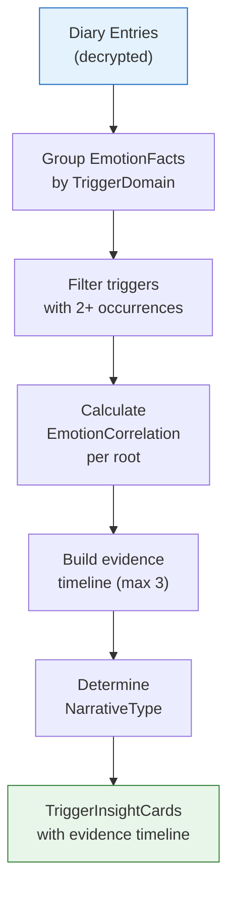

**Narrative Types:**
- *"Your work has been your main source of anxiety"* (Primary Source)
- *"Your family continues to be a source of joy"* (Positive Source)
- *"Finances are influencing your worry and hope"* (Mixed Influence)

Each card includes animated horizontal bars with emotional distribution, evidence timeline below each bar (max 3 contexts), and a "see X more" link that opens a bottom sheet with all contexts.

### Summary Metrics

| Metric | Calculation |
|--------|-------------|
| `totalEntries` | Entry count in the period |
| `averageMood` | Weighted average of emotional intensity |
| `moodDistribution` | Frequency and percentage per emotion |
| `topEmotions` | Top 5 most frequent emotions |
| `emotionTrends` | Intensity evolution (day/week/month/year) |
| `triggerInsights` | Top 4 triggers with evidence correlation |

### PDF Export

Multi-page wellness report with emotion distribution pie chart, trigger correlations, evidence timelines, and pattern analysis — designed to be shared with therapists.

---

## Internationalization (i18n)

### Full Bilingual Support

| Language | File | Role |
|----------|------|------|
| Spanish | `res/values/strings.xml` | Default |
| English | `res/values-en/strings.xml` | Alternative |

- **Enum localization** via extension functions (`emotion.localizedName()`, `trigger.localizedName()`)
- **Bilingual AI prompts** via `PromptProvider.kt` (auto-detects language)
- **Per-app language** configured via `locales_config.xml` + `LanguagePreferences.kt`
- **Plural strings** using Android `<plurals>` resources for correct singular/plural forms

---

# Part II — iOS (Native Companion)

## iOS Architecture

DayMood iOS is a **native SwiftUI implementation** with Clean Architecture, mirroring the Android app's modular structure using Swift Package Manager.

**Current Version:** 1.2.0 (Build 26031501) | **Min iOS:** 17.0 | **Swift:** 6.0

### Module Structure (Swift Package Manager)

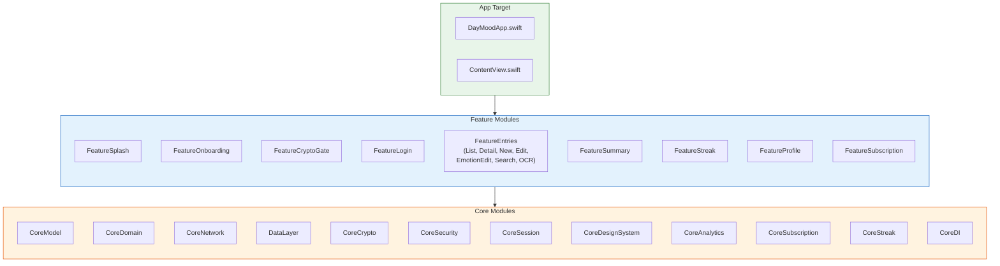

### ViewModel Pattern

iOS uses Swift's `@Observable` macro with `@MainActor` for thread-safe state management:

```swift
@Observable
@MainActor
final class EntryNewViewModel {
    var uiState = EntryNewUIState()
    var isLoading = false

    private let repository: DiaryRepository

    func analyzeEntry() async {
        isLoading = true
        defer { isLoading = false }
        uiState.result = try? await repository.analyze(uiState.entry)
    }
}
```

---

## iOS Tech Stack

| Category | Android | iOS |
|----------|---------|-----|
| **Language** | Kotlin 2.3.0 | Swift 6.0 |
| **UI** | Jetpack Compose | SwiftUI |
| **Package Manager** | Gradle (19 modules) | SPM (30+ targets) |
| **DI** | Hilt | Manual DI / Factory Pattern |
| **Async** | Coroutines + Flow | async/await + AsyncSequence |
| **Navigation** | Navigation 3 | NavigationStack + AppRouter |
| **Crypto** | javax.crypto + Jetpack Security | CryptoKit + Keychain |
| **OCR** | ML Kit | Apple Vision Framework |
| **Auth** | Google Sign-In | Google + Apple Sign-In |
| **Subscriptions** | Google Play Billing 7.x | StoreKit 2 |
| **App Check** | Play Integrity | App Attest |
| **Secure Storage** | EncryptedSharedPreferences | Keychain Services |

---

## iOS Navigation

iOS uses a **SwiftUI NavigationStack** with a custom `@Observable AppRouter`:

```swift
@MainActor
@Observable
final class AppRouter {
    var path: [AppRoute] = []
    var selectedTab: TabBarItem = .entries
    var presentedSheet: AppRoute?
    var presentedFullScreenCover: AppRoute?

    func navigate(to route: AppRoute) { path.append(route) }
    func pop() { path.removeLast() }
    func switchTab(to tab: TabBarItem) { ... }
}
```

**Tab Bar (4 items):** Entries, Summary, Streak, Profile

---

## iOS-Specific Features

| Feature | iOS | Android Equivalent |
|---------|-----|--------------------|
| **Apple Sign-In** | Native (required by App Store) | N/A |
| **Vision OCR** | Apple Vision Framework | ML Kit |
| **Secure Enclave** | Hardware-backed key storage | Android Keystore |
| **App Attest** | App integrity verification | Play Integrity |
| **StoreKit 2** | Subscription management | Google Play Billing |
| **Trial eligibility** | `isEligibleForIntroductoryOffer` | Offer-based detection |
| **Privacy manifest** | `PrivacyInfo.xcprivacy` | Play Data Safety section |

---

# Cross-Platform Strategy

## Design Philosophy

DayMood follows a **native-per-platform** approach: no cross-platform framework (KMM, Flutter, React Native). Each platform uses its native language and UI toolkit, sharing only the backend (Firebase) and cryptographic protocols.

**Rationale:**
- Best UX per platform, following each platform's design guidelines
- Full access to platform capabilities (Keychain, Keystore, Vision, ML Kit)
- Independent release cycles
- No cross-platform framework limitations or abstractions

## Shared Firestore Schema

Both platforms read and write to the same Firestore collections with identical field names and enum storage conventions:

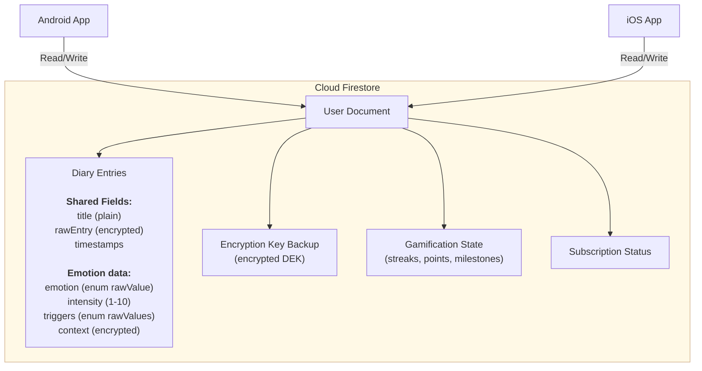

**Enum Storage Rule:** Both platforms store `.rawValue` strings (e.g., `"JOY"`, `"WORK_CAREER"`), never display names or localized strings. This ensures cross-platform compatibility.

**Streak Parity:** Both platforms use identical milestone keys (`STREAK_7`, `EMOTION_EXPLORER`, etc.) and the same points system, ensuring a user's progress is visible on both devices.

## Cross-Platform E2E Encryption

The encryption protocol is designed for **cross-device and cross-platform compatibility**: a user who creates entries on Android can read them on iOS and vice versa.

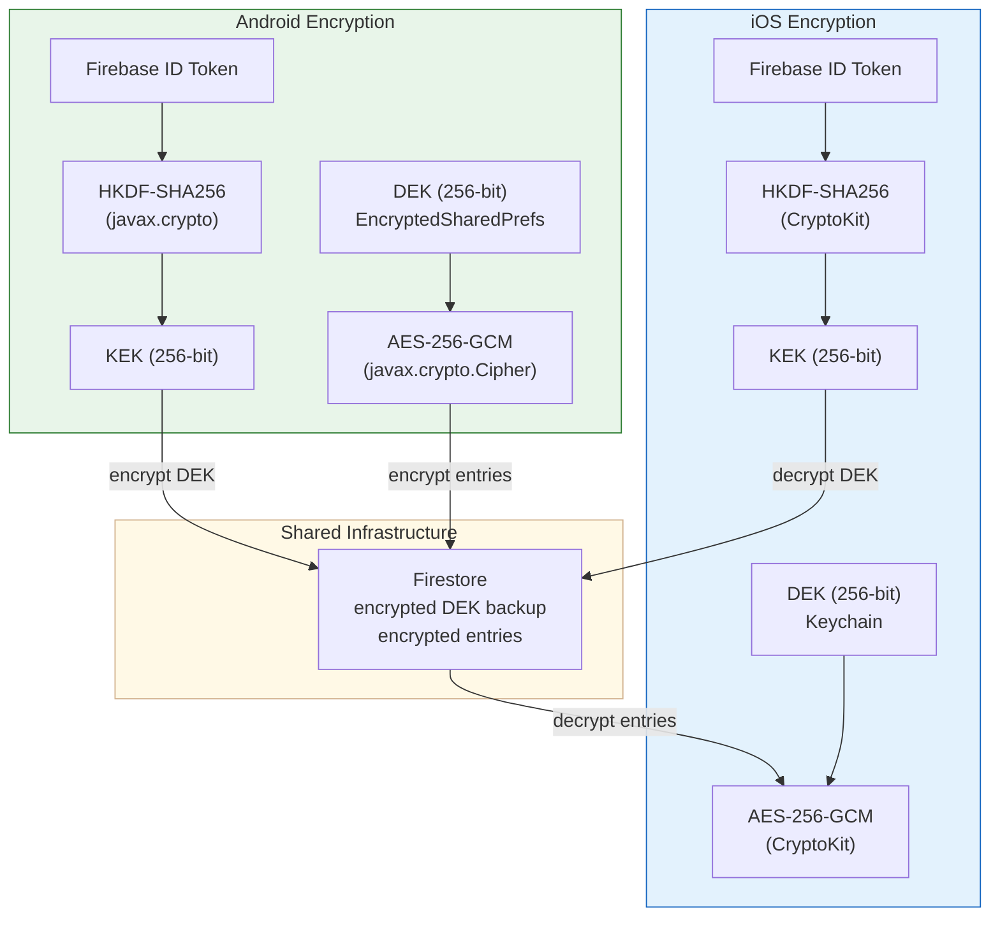

### Cross-Platform Compatibility Details

| Concern | Solution |
|---------|----------|
| **Key derivation** | Both use HKDF-SHA256 with identical application-specific salt and context parameters |
| **Stable JWT claims** | Both extract the same stable claims from Firebase ID Token for deterministic KEK derivation |
| **Cipher format** | Both use an identical ciphertext serialization format (AES-256-GCM) for cross-platform compatibility |
| **KEK versioning** | Multiple KEK versions with automatic fallback to handle auth provider migration scenarios |
| **Fallback parsing** | iOS includes fallback ciphertext parsing to handle Android-serialized data gracefully |

### Key Derivation from JWT (Deterministic KEK)

Firebase ID Tokens are JWTs that change every session (`iat`, `exp`, `auth_time`). To ensure the **same KEK is derived regardless of when the user logs in**, both platforms extract only the **stable, user-specific claims** from the token. These are combined and passed through HKDF-SHA256 with application-specific parameters to produce a deterministic 256-bit KEK — ensuring the same user always derives the same key, on any device and platform.

## Feature Parity Matrix

| Feature | Android | iOS | Notes |
|---------|---------|-----|-------|
| Plutchik 32 emotions | ✅ | ✅ | Identical enum values |
| EmotionWheel (pizza slice) | ✅ | ✅ | Same visual design |
| Gemini 2.5 Pro (primary AI) | ✅ | ✅ | Firebase AI SDK on both |
| OpenAI GPT-4o (fallback) | ✅ | ✅ | Retrofit / URLSession |
| Remote Config AI switching | ✅ | ✅ | Same config keys |
| E2E Encryption | ✅ | ✅ | Cross-platform compatible |
| CryptoGate screen | ✅ | ✅ | Blocks until crypto ready |
| Google Sign-In | ✅ | ✅ | Credential Manager / GoogleSignIn-iOS |
| Apple Sign-In | — | ✅ | iOS-only (App Store requirement) |
| Email/Password auth | ✅ | ✅ | Firebase Auth |
| OCR text recognition | ✅ (ML Kit) | ✅ (Vision) | Platform-native |
| Rich text / Markdown | ✅ | ✅ | compose-rich-editor / native |
| Premium subscription | ✅ (Play Billing) | ✅ (StoreKit 2) | Platform-native billing |
| Streak & gamification | ✅ | ✅ | Shared Firestore milestones |
| Points redemption | ✅ | ✅ | Atomic Firestore transactions |
| Daily reminders | ✅ (WorkManager) | ✅ (UNNotification) | Platform-native scheduling |
| Summary & insights | ✅ | ✅ | Same calculation algorithm |
| Trigger evidence timeline | ✅ | ✅ | Same UX pattern |
| PDF export | ✅ | ✅ | Platform-native rendering |
| Crisis detection | ✅ | ✅ | Same keyword patterns |
| Wellness disclaimer | ✅ | ✅ | Same content, platform UI |
| Privacy firewall | ✅ (4 layers) | ✅ (4 layers) | Same architecture |
| App Check | ✅ (Play Integrity) | ✅ (App Attest) | Platform-native attestation |
| GDPR data export | ✅ | ✅ | JSON via share intent |
| Bilingual (ES/EN) | ✅ | ✅ | Per-app language support |
| Rewarded ads | ✅ | ✅ | Google Mobile Ads |
| In-app review | ✅ | ✅ | Play Review / SKStoreReview |

---

## Results & Impact

### Production Timeline

| Version | Date | Key Milestone |
|---------|------|---------------|
| **1.0.0** | Jan 2026 | Production release (Android) |
| **2.0.0** | Feb 8, 2026 | Premium subscription + Search |
| **2.1.0** | Feb 28, 2026 | Optional AI + Rich text + Ads |
| **2.2.0** | Mar 9, 2026 | Streak & gamification |
| **2.3.2** | Mar 16, 2026 | Crisis detection + Wellness disclaimer + GDPR |
| **iOS 1.0.0** | Feb 2026 | iOS App Store release |
| **iOS 1.2.0** | Mar 2026 | Feature parity alignment |

### Technical Achievements

- **98.64% crash-free users** (Crashlytics, 90-day window) with silent non-fatal reporting across 9 critical modules
- **2,296 first opens** in a 28-day measurement window, peaking at ~165 devices/day across 5+ countries
- **96.5% AI adoption** among users who create entries
- **100%** localization coverage (Spanish/English)
- **32 emotions** mapped based on Plutchik's psychological model
- **19 Gradle modules** (Android) + **30+ SPM targets** (iOS)
- **E2E encryption** with AES-256-GCM: complete user privacy, cross-platform compatible
- **4-layer privacy firewall**: defense-in-depth security architecture on both platforms
- **Dual AI provider** with data-driven selection (10-entry evaluation documented)
- **13 gamification milestones** with points economy

### Architectural Milestones

- **Multi-module Clean Architecture** on both platforms with strict layer separation
- **Dual AI provider system** with Factory pattern + Remote Config for zero-downtime switching
- **Navigation 3** (Android) and **NavigationStack + AppRouter** (iOS) — modern, type-safe navigation
- **Cross-platform E2E encryption** with deterministic key derivation from JWT stable claims
- **CryptoGate screen** pattern adopted on both platforms to eliminate crypto initialization race conditions
- **Gradle Configuration Cache** compatibility for build optimization

---

## Learnings & Challenges

### Technical Challenges Overcome

1. **Cross-platform encryption compatibility**: Ensuring AES-256-GCM ciphertext serialization is identical between Android's `javax.crypto` and iOS's `CryptoKit`. Solved with a shared serialization format and fallback parsing on iOS for Android-generated data.

2. **Deterministic KEK from rotating JWTs**: Firebase ID Tokens change every session. Solved by extracting only stable, user-specific claims for HKDF derivation, ensuring the same KEK is produced regardless of when or where the user logs in.

3. **KEK versioning across auth providers**: Early versions included provider-specific claims, causing issues when users switched auth methods. Solved with provider-independent key derivation and automatic fallback for legacy keys.

4. **AI analysis consistency**: Designing prompts that produce structured output consistent with Plutchik's model across two different AI providers with different response characteristics.

5. **Crypto initialization race condition**: ViewModels accessing uninitialized DEK on cold start. Solved with the CryptoGate pattern — a blocking intermediate screen adopted on both platforms.

6. **Privacy firewall at scale**: Building a 4-layer defense-in-depth system that prevents PII leakage through logs, analytics, and monitoring, while still allowing useful telemetry (latency, token counts, error rates).

7. **Trial eligibility across platforms**: Google Play Billing uses offer-based detection (presence of zero-cost pricing phase), while StoreKit 2 uses `isEligibleForIntroductoryOffer`. Both needed unified UI behavior.

### Key Architectural Decisions

| Decision | Rationale |
|----------|-----------|
| Native per-platform (no KMM) | Best UX per platform, full platform capabilities, independent release cycles |
| Gemini over OpenAI (primary) | Data-driven: deeper analysis quality, 20% lower cost, 100% valid JSON in 10-entry evaluation |
| Firestore over Room/CoreData | Multi-device sync and cross-platform compatibility without custom backend |
| AES-256-GCM with HKDF | Absolute privacy: developer can't read entries; deterministic key derivation enables multi-device |
| DEK backup in Firestore | Multi-device recovery without compromising security |
| Navigation 3 (Android) | Future-proof: official successor to Compose Navigation; direct backstack manipulation |
| CryptoGate screen | Eliminates race conditions; clean separation between auth and crypto initialization |
| Factory pattern for AI | Zero-downtime provider switching via Remote Config |
| 4-layer privacy firewall | Defense-in-depth: no single point of failure for PII protection |
| Play Billing / StoreKit 2 | Direct integration without third-party abstraction layer |

---

*Developed by Jaime Lopez — Senior Mobile Developer*

*Stack: Kotlin 2.3.0 | Swift 6.0 | Jetpack Compose | SwiftUI | Navigation 3 | Material 3 | Google Gemini 2.5 Pro | OpenAI GPT-4o | Firebase | AES-256-GCM | HKDF-SHA256 | Google Play Billing | StoreKit 2*

---

*Last updated: March 16, 2026 — Android v2.3.2 | iOS v1.2.0*
